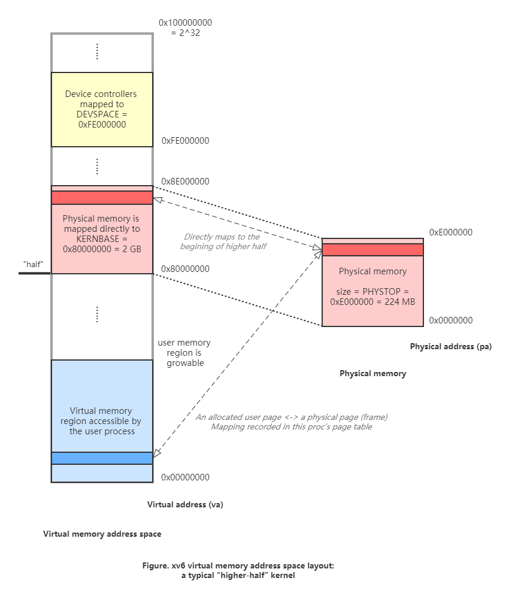

# CS537 SP2021 DIS-315 Week 9

Copyright 2021 Guanzhou Hu

Topics:

- xv6 virtual memory design
    - Memory layout
    - Built-in utilities to help you translate between:
        - User virtual address (uva)
        - Physical address (pa)
        - Kernel address (ka)
    - Two-level page table
- Page fault trap mechanism
- P5 (part A) overview & tips

Links:

- Chapter 2 & 3 of the [xv6 book](https://pdos.csail.mit.edu/6.828/2018/xv6/book-rev11.pdf)

## xv6 Virtual Memory Design

Recall that xv6 is a 32-bit system, so a virtual address is 32-bit in length, able to address up to a 4GB virtual memory address space. xv6 follows a typical "higher-half" kernel memory layout design.

- Each user process has the illustion of its virtual address space, size 4GB (0x00000000 to 2^32-1). User program uses virtual address
- Lower half belongs to the user:
    - Code at the bottom
    - Data starts small but is growable - remember the *stack* and the *heap*
- The kernel owns the higher half (0x80000000 to top), user not allowed to access these parts:
    - Entire physical memory maps onto the begining of the kernel half

### Memory Layout Graph

This figure is an overview of the memory layout:

**Question: say a user process calls some syscall/traps into the kernel. How does the kernel access/modify the byte at user address `uva`?**

In summary, we have the following three addresses for a user byte:

1. User virtual address (uva): from user's view, the virtual address of the byte in lower half
2. Physical address (pa): where is the byte actually in physical memory
3. Kernel address (ka or kva): == pa + KERNBASE, i.e., the virtual address of the mapped physical byte

**Answer to above question**: the kernel walks the page table to find out the physical address `pa`. Then, simply adds `KERNBASE` to it to get `ka`. Then, access/modify the byte at `ka`.

### Translation Utilities

xv6 has a bunch of utilities for translation:

- pa to ka: `P2V()` (**How?**  Simply `+= KERNBASE 0x80000000`)
- ka to pa: `V2P()` (**How?**  Simply `-= KERNBASE 0x80000000`)
- uva to pa: **Question: who carries out this translation?**
- pa to uva: not necessary
- uva to ka: `uva2ka()`, combines uva-to-pa with pa-to-ka

**Answer to above question**: the page table of current process. See the `vm.c: walkpgdir()`. The entire page table is in memory, but may be cached by the CPU (recall TLBs), so after you modify anything in a page table entry, do `switchuvm(myproc())` to force a reload.

### Two-level Page Table

This part should have been well covered in lectures.

Specifically in xv6, it uses a two-level page table:

- The root level is named the **page directory**
- Each entry of the page directory (`pde`) points to an inner level **page table** (`pte`)
- Each `pte` holds the physical address of that virtual page and some flag bits

To see the definition of a PTE and what each bit means, see `mmu.h`.

## Page Fault Trap Mechanism

## P5 (Part A) Overview

